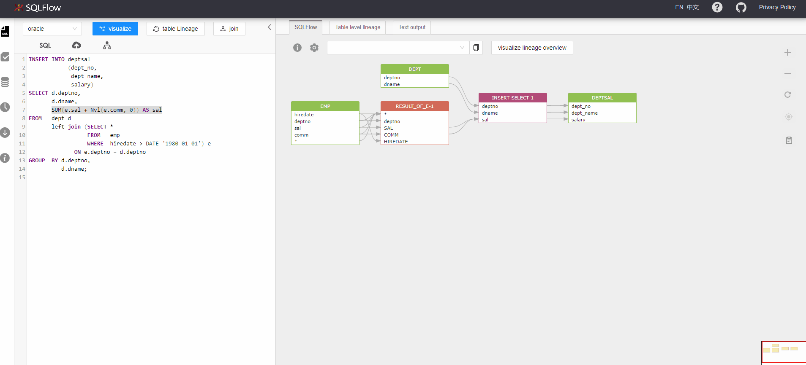
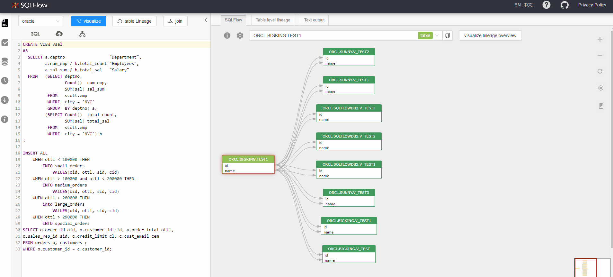

# What is Gudu SQLFlow?

提纲 DRAFT

描述见这里： [https://www.gudusoft.com/gudu-sqlflow-media-kit/](https://gitee.com/link?target=https://www.gudusoft.com/gudu-sqlflow-media-kit/)\
\
[https://github.com/sqlparser/sqlflow\_public](https://github.com/sqlparser/sqlflow\_public)

## Product Icon

<figure><figcaption></figcaption></figure>

## Product Description

\
Gudu SQLFlow is a data lineage tool that analyzes and discovers data lineage from  SQL queries and databases.

Gudu SQLFlow provides a visual representation of the overall flow of data.\
Automated SQL data lineage analysis across Databases, ETL, Business Intelligence,\
Cloud and Hadoop environments by parsing SQL Script and stored procedure.

Depict all the data movement graphically.

<figure><figcaption></figcaption></figure>

## Product Features

* Analyzes multiple SQL files at once;
* Connects to the database to analyze the data lineage for you in real-time;
* Analyzes different data sources such as Redshift log, Snowflake query history, DBT scripts, etc., and quickly discover the data lineage relationship in the enterprise data platform;
* Provides Rest API interface to quickly integrate with your data governance platform;
* Provides Java libraries to deploy to end customers along with your data governance tools;
* Provides front-end UI library to quickly provide interactive data lineage relationship display function for your data governance platform;
* Provides an integrated solution with datahub open source metadata management software;

## More screenshots

Show SQL expression doing the transformation

<figure><figcaption></figcaption></figure>

Connect to the database to discover data lineage

<figure><figcaption></figcaption></figure>

## Link to the product

If you write an article concerning Gudu SQLFlow, feel free to link to any pages on this site: [https://www.gudusoft.com](https://www.gudusoft.com/)

If uncertain about which page to cite, we recommend this page: [https://www.gudusoft.com/sql-data-lineage-tool/](https://www.gudusoft.com/sql-data-lineage-tool/)

We have also prepared one Gudu SQLFlow yearly premium accounts ($600) for you, if in need, reach out to me by filling in the form below.
