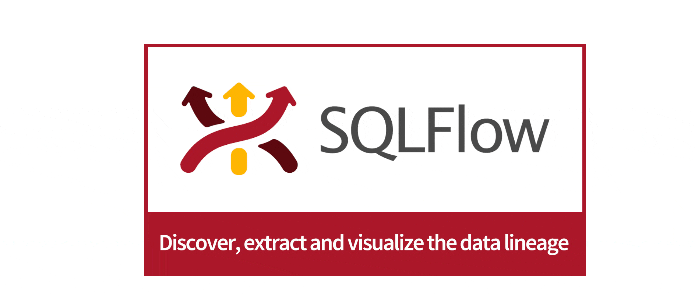

# What is Gudu SQLFlow?

DRAFT

描述见这里： [https://www.gudusoft.com/gudu-sqlflow-media-kit/](https://gitee.com/link?target=https://www.gudusoft.com/gudu-sqlflow-media-kit/)\
\
[https://github.com/sqlparser/sqlflow\_public](https://github.com/sqlparser/sqlflow\_public)

## Product Icon

<figure><figcaption></figcaption></figure>

## Product Description

\
Gudu SQLFlow is a data lineage tool that analyzes and discovers data lineage from  SQL queries and databases.

Gudu SQLFlow provides a visual representation of the overall flow of data.\
Automated SQL data lineage analysis across Databases, ETL, Business Intelligence,\
Cloud and Hadoop environments by parsing SQL Script and stored procedure.

Depict all the data movement graphically.

<figure><figcaption></figcaption></figure>
