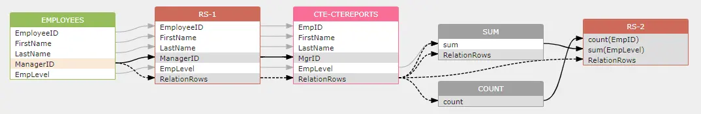

# Dataflow chain

If the resultset of a subquery or CTE is used in the from clause of the upper-level statement, then the impact of the lower level resultset will be transferred to the upper-level.

```sql
WITH
  cteReports (EmpID, FirstName, LastName, MgrID, EmpLevel)
  AS
  (
    SELECT EmployeeID, FirstName, LastName, ManagerID, EmpLevel  -- resultset1
    FROM Employees
    WHERE ManagerID IS NULL
  )
SELECT
  count(EmpID), sum(EmpLevel)  -- resultset2
FROM cteReports 
```

In the CTE, there is an impact relation:

```
Employees.ManagerID -> indirect -> RS-1.RelationRows
```

Since `cteReports` is used in the from clause of the upper-level statement, then the impact will carry on like this:

```
Employees.ManagerID -> indirect -> RS-1.RelationRows -> indirect -> CTE-CTEREPORTS.RelataionRows
```

If we ignore the intermediate resultset, the end to end dataflow is :

```
Employees.ManagerID -> indirect -> RS-2.COUNT(EmpID)
Employees.ManagerID -> indirect -> RS-2.SUM(EmpLevel)
```

**diagram**

<figure><figcaption></figcaption></figure>
