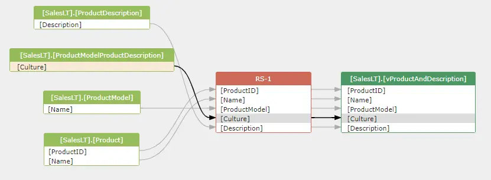
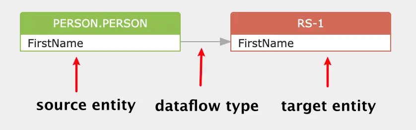
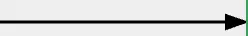
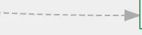
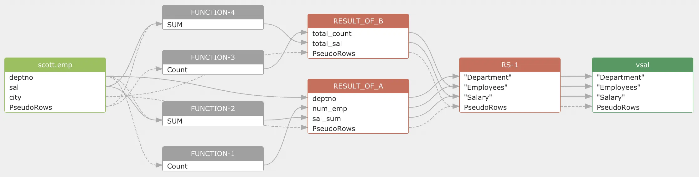

# Dataflow

SQLFlow generates data lineage by analyzing SQL queries and stored procedures.

The entity in the data lineage model includes table, column, function, relation and other entities . The combination of the entity and dataflow shows the lineage from one table/column to another.

<figure><figcaption></figcaption></figure>

### 1. A dataflow unit

A dataflow unit includes a source entity, a target entity and a dataflow type between them.

```sql
SELECT p.FirstName
from Person.Person AS p 
```

This is the dataflow generated for the above SQL query.

```
person.persion.FirstName -> direct -> RS-1.FirstName
```

<figure><figcaption></figcaption></figure>

#### 1.1 Source, target entity

Source and target entity usually referes to table, view and other relations such as common table expression, result set generated during the execution of the query. It may also refers to a file in the HDFS system and etc.

#### 1.2 Dataflow type

There are two types of dataflow: direct and indirect.

**1.2.1 Direct dataflow**

The direct dataflow means the data of the target entity comes directly from the source entity.

In the above diagram, the data of `RS-1.FirstName` comes from the `Person.FirstName` directly.

An arrow is used to represent a direct dataflow in the diagram:

<figure><figcaption></figcaption></figure>

**1.2.2 Indirect dataflow**

The indirect dataflow means the data of the target column does not come from the source column, but the data of the source column/table impact the result data of the target column.

A dotted line arrow is used to represent an indirect dataflow in the diagram:

<figure><figcaption></figcaption></figure>

The source column in the indirect dataflow usually appears in the following clause:

* Where clause
* Group by clause
* Winddows function
* Join condition

```sql
SELECT deptno, COUNT() num_emp, SUM(SAL) sal_sum
FROM scott.emp
GROUP BY deptno
```

The value of COUNT() and SUM(SAL) is impacted by the value of column `deptno` in the group by clause. So the indirect dataflows will be created like this:

```
scott.emp.deptno -> indirect -> COUNT()
scott.emp.deptno -> indirect -> SUM(SAL)
```

<figure><figcaption></figcaption></figure>

For other indirect dataflows, we will discuss later.

**1.2.3 Join**

The `join` relationship build a link between 2 or more columns in the join condition. Striclty speaking, the relation is not a dataflow type.

```sql
 select b.teur
 from tbl a left join TT b on (a.key=b.key)
```

A join relationship will be created after analzying the above SQL. It indicates a join relationship betwee `tbl.key` and `TT.key`.

<figure><figcaption></figcaption></figure>

### 2. The entity in dataflow

When build dataflow between 2 entities: the source and target entity. They can be column to column, or, table to colum, or table to table.

#### 2.1 column to column

This is the most usual case. Both entites in a dataflow are columns.

#### 2.2 table to column

It is meant to say the total number of rows of a table impacts the value of a column when we say a table is impacting the value of a column. In most of cases, the column is derived from a COUNT() function.

```sql
SELECT COUNT() num_emp
FROM scott.emp
```

A table to column dataflow is represented by using a RelationRows pseduo column. An indirect dataflow is built from scott.emp.RelationRows to RS-1.num\_emp

```sql
scott.emp.RelationRows -> indirect -> COUNT() -> RS-1.num_emp
```

<figure><figcaption></figcaption></figure>

#### 2.3 table to table

Sometimes, there will be a dataflow between 2 tables. For example, in an `alter table rename` SQL statement, a table to table dataflow will be created. Acutally, a table to table dataflow is represented by a column to column dataflow using the `RelationRows` pseudo column.

```sql
alter table t2 rename to t3;
```

<figure><figcaption></figcaption></figure>

### 3. Data lineage

A data lineage consists of lots of basic dataflow units.

```sql
CREATE VIEW vsal 
AS 
  SELECT a.deptno                  "Department", 
         a.num_emp / b.total_count "Employees", 
         a.sal_sum / b.total_sal   "Salary" 
  FROM   (SELECT deptno, 
                 Count()  num_emp, 
                 SUM(sal) sal_sum 
          FROM   scott.emp 
          WHERE  city = 'NYC' 
          GROUP  BY deptno) a, 
         (SELECT Count()  total_count, 
                 SUM(sal) total_sal 
          FROM   scott.emp 
          WHERE  city = 'NYC') b 
```

The data lineage diagram:

<figure><figcaption></figcaption></figure>

The output also available in XML or JSON format .

### 4. References

1. xml code used in this article is generated by [DataFlowAnalyzer ](../../introduction/java-library/overview.md#dataflowanalyzer)tools
2. digram used in this article is generated by the [Gudu SQLFlow Cloud version](https://sqlflow.gudusoft.com/)
