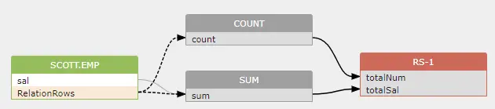
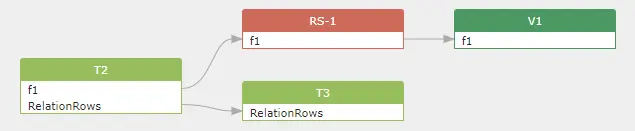
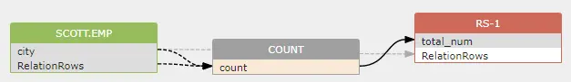
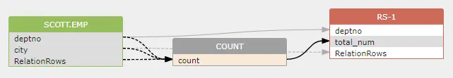
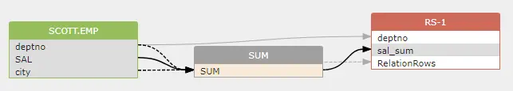
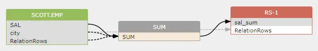

# Indirect Dataflow

This article introduces some SQL elements that generate indirect dataflow. Indirect dataflow usually is generated from columns used in the where clause, group by clause, aggregate function and etc.

## **RelationRows**

In order to create indirect dataflow between columns, we introduce a pseudo column: **RelationRows**.

RelationRows is a pseudo column of a relation used to represents the number of rows in a relation. As its name indicates, RelationRows is not a real column in the relation(table/resultset and etc). Usually, It is used to represents a dataflow between a column and a relation.

RelationRows pseudo column can be used in both the source and target relation.

### 1 RelationsRows in target relation

Take this SQL for example:

```sql
SELECT a.empName "eName"
FROM scott.emp a
Where sal > 1000
```

The total number of rows of the select list is impacted by the value of column `sal` in the where clause. So, an indirect dataflow is created like this:

```
scott.emp.sal -> indirect -> RS-1.RelationRows
```

<figure><figcaption></figcaption></figure>

### 2 RelationRows in source relation

Here is another sample:

```sql
SELECT count() totalNum, sum(sal) totalSal 
FROM   scott.emp 
```

The value of `count()` function and `sum(sal)` function is impacted by the number of rows in the `scott.emp` source table.

```
scott.emp.RelationRows -> indirect -> count()
scott.emp.RelationRows -> indirect -> sum(sal)
```

<figure><figcaption></figcaption></figure>

### 3. Table level dataflow using RelationRows

RelationRows is also used to represent table level dataflow.

```sql
alter table t2 rename to t3;
```

A table level dataflow is not built on a table, but on the pseudo column `RelationRows` like this:

```sql
t2.RelationRows -> direct -> t3.RelationRows
```

<figure><figcaption></figcaption></figure>

Build a table to table dataflow that using the RelationRows pseudo column for 2 reasons:

* This pseudo column that used to represent a table to column dataflow will be used to generate a table to table dataflow later if user need a table-level lineage model.
* If other columns in the same table are used in a column to column dataflow while this table itself is also in a table to table dataflow, then, this pseudo column will make it possible for a single table to includes both the column to column dataflow and table to table dataflow.

take this SQL for example

```sql
create view v1 as select f1 from t2;
alter table t2 rename to t3;
```

The first create view statement will generate a column-level dataflow between the table `t2` and view `v1`,

```sql
t2.f1 -> direct -> RS-1.f1 -> direct -> v1.f1
```

while the second alter table statement will genereate a table-level dataflow between the table t2 and t3.

```sql
t2.RelationRows -> direct -> t3.RelationRows
```

<figure><figcaption></figcaption></figure>

As you can see, Table `t2` involved in the column to column dataflow generated by the `create view` statement, It also involved in a table to table dataflow generated by the `alter table` statement. A single table `t2` in the above digram shows that it includes both the column to column dataflow and a table to table dataflow.

## Where and Group-By

### 1. Columns in where clause

Some of the columns in source tables in WHERE clause do not influence target columns but are crucial for the selected row set, so they should be saved for impact analyses, with an indirect dataflow to the target tables.

Take this SQL for example:

```sql
SELECT a.empName "eName"
FROM scott.emp a
Where sal > 1000
```

The total number of rows of the select list is impacted by the value of column `sal` in the where clause. We build an indirect dataflow for this relationship.

```
scott.emp.sal -> indirect -> RS-1.RelationRows
```

<figure><figcaption></figcaption></figure>

### 2. COUNT()

COUNT() function is an aggregate function that used to calculate the total number of rows of a relation.

#### 2.1 where clause without group by clause

```sql
SELECT COUNT() num_emp
FROM scott.emp
where city=1
```

In above SQL, two indirect dataflows will be created, because the value of COUNT() is impacted by the city column in where clause and the total number of rows of scott.emp table.

```sql
scott.emp.city -> indirect -> COUNT()
scott.emp.RelationRow -> indirect -> COUNT()
```

<figure><figcaption></figcaption></figure>

#### 2.2 where clause with group by clause

```sql
SELECT deptno, count() total_num
FROM scott.emp
where city=1
group by deptno
```

As you can see, besides the two indirect dataflows created in the previous SQL, a third indirect dataflow is created using the deptno in the group by clause.

```sql
scott.emp.city -> indirect -> COUNT()
scott.emp.Relations -> indirect -> COUNT()
scott.emp.deptno -> indirect -> COUNT()
```

<figure><figcaption></figcaption></figure>

### 3. Other aggregate function

When creating indirect dataflow, other aggregate functions such as SUM() works **a little bit differently** to the COUNT() function.

#### 3.1 where clause with group by clause

```sql
SELECT deptno, SUM(SAL) sal_sum
FROM scott.emp
where city=1
group by deptno
```

aggregate function such as SUM() calculates the value from a record set determined by the columns used in the group by clause, so deptno column in the group by clause is used to create an indirect dataflow to SUM() function.

an indirect dataflow is created from deptno to SUM().

```sql
scott.emp.deptno -> indirect -> SUM()
```

**RelationRows pseudo column will not be used to create an indirect dataflow if group by clause if presented.**

<figure><figcaption></figcaption></figure>

#### 3.2 where clause without group by clause

```sql
SELECT SUM(SAL) sal_sum
FROM scott.emp
where city=1
```

The above SQL means that the whole record set of the table will be used to calculate the value of SUM() function.

So two indirect dataflows will be created as below:

```sql
scott.emp.city -> indirect -> SUM()
scott.emp.RelationRows -> indirect -> SUM()
```

<figure><figcaption></figcaption></figure>

### 4. Summary

* Columns in where clause always create an indirect dataflow to all aggregate functions used in the select list.
* RelationRows pseudo column always create an indirect dataflow to COUNT() function, but only create an indirect dataflow to other aggregate functions such as SUM() when the group by clause is not used.
* Columns in the group by clause always create an indirect dataflow to all aggregate functions used in the select list.

## References

1. xml code used in this article is generated by [DataFlowAnalyzer](../../introduction/java-library/overview.md#dataflowanalyzer) tools
2. digram used in this article is generated by the [Gudu SQLFlow Cloud version](https://sqlflow.gudusoft.com/)
