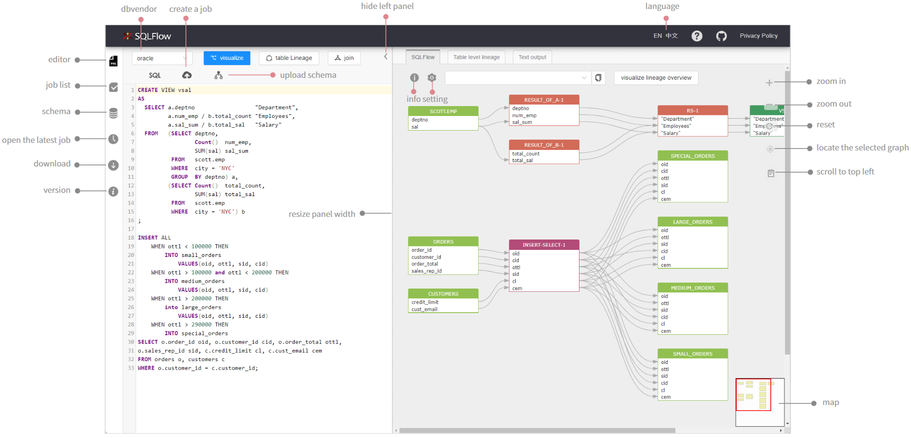

# UI

### How it works?

The data of SQLFlow frontend are mainly from **/sqlflow/generation/sqlflow/graph**. After getting the response of the interface, SQLFlow frontend analyzes the field _`graph`_ and the field _`sqlflow`_

Corresponding graphs and links are made based on the analysis. When clicking different buttons or making different settings on UI, we are actually giving different inputs to the request of the interface so that we are able to visualize the data lineage.

Read more about the SQLFlow API [here](https://github.com/sqlparser/sqlflowbook/blob/main/introduction/ui/broken-reference/README.md).

### Overview

<figure><figcaption></figcaption></figure>

Read more about the SQLFlow frontend:

* [SQLText Editor](sqltext-editor.md)
* [Settings](settings.md)
* [Job Management](job-management.md)
* [Schema](schema.md)
