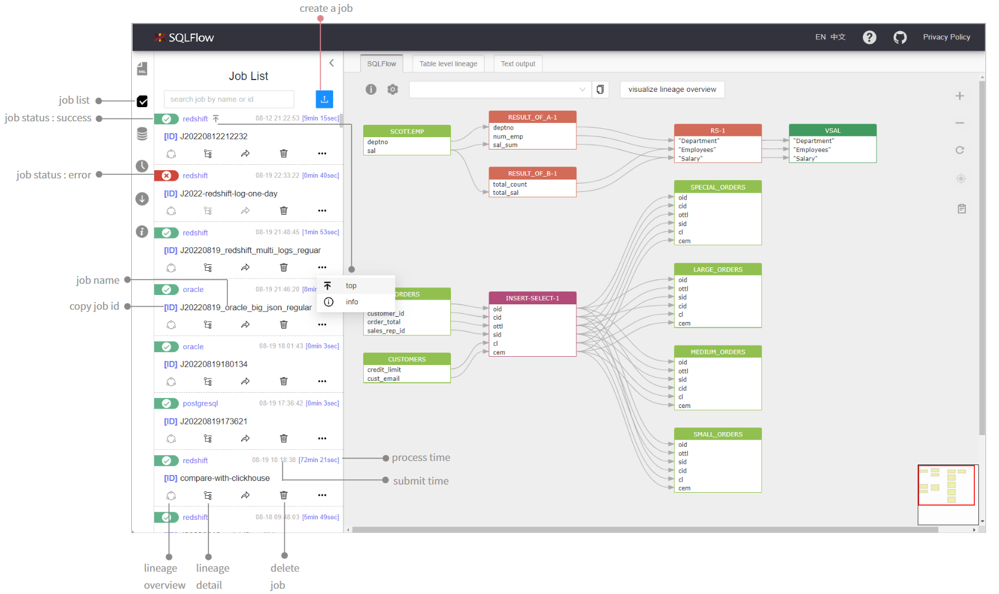
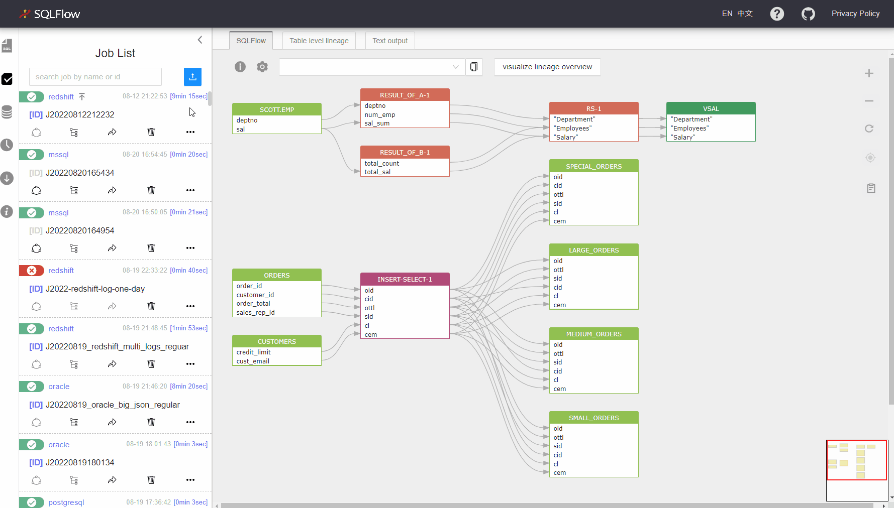
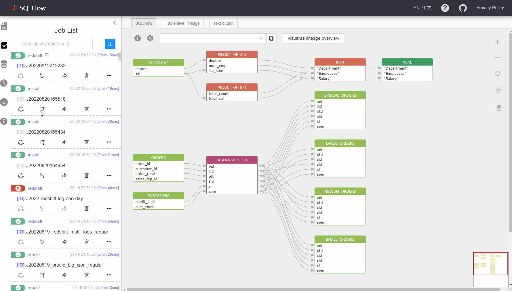

# Job Management

### Job list

<figure><figcaption></figcaption></figure>

### Create a job

<figure><figcaption></figcaption></figure>

### Backwards in code

<figure><figcaption></figcaption></figure>

