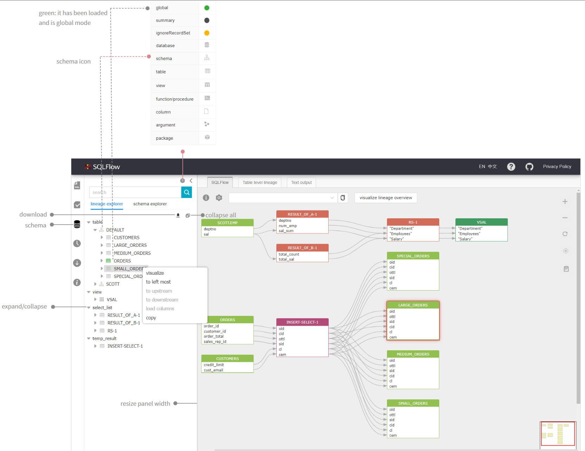
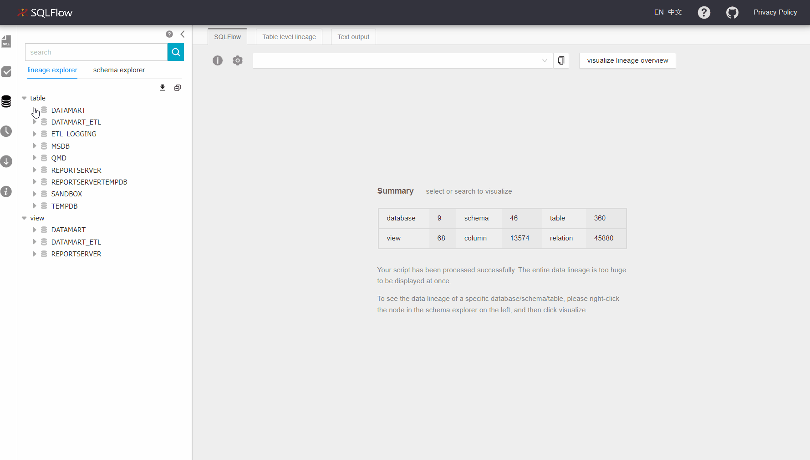
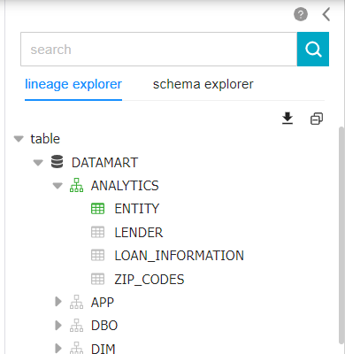
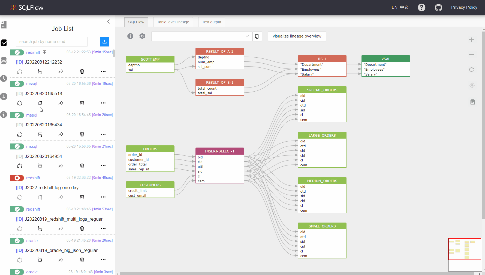

# Schema

<figure><figcaption></figcaption></figure>

Visualize SQL schema by choosing any elements:

<figure><figcaption></figcaption></figure>

There are three modes(the mode field in json) to display the response returned by graph AP which are represented by three different colors:

* global
* summay
* ignore record

<figure><figcaption></figcaption></figure>

The green icons of ANALYTICS and ENTITY indicat that the mode is _global_;&#x20;

The black icons of DATAMART indicat that the mode is _summary_;&#x20;

The gray icons of other nodes indicat that the nodes are not visualized.

### View DDL(Data Definition Language))

<figure><figcaption></figcaption></figure>
