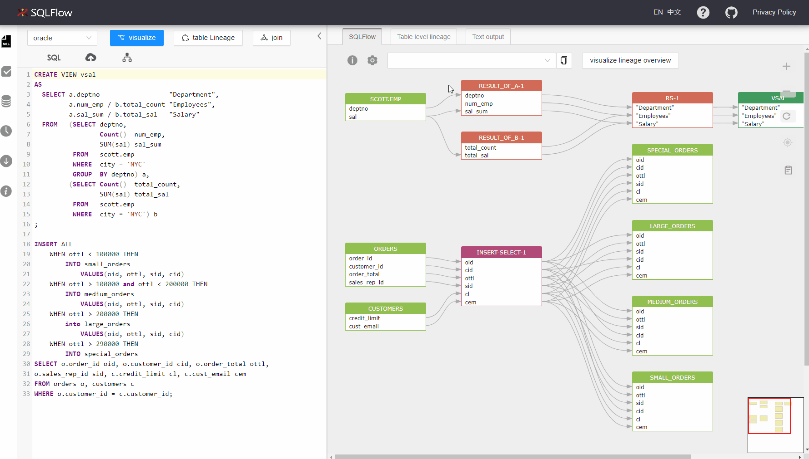
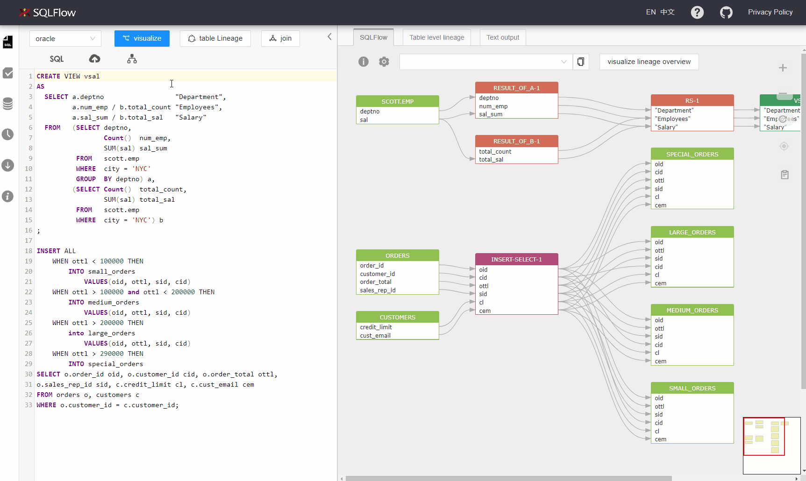
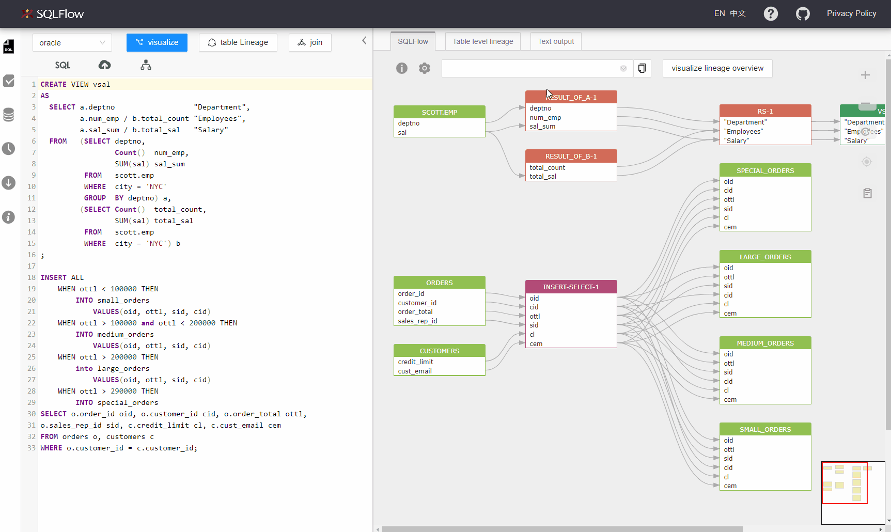
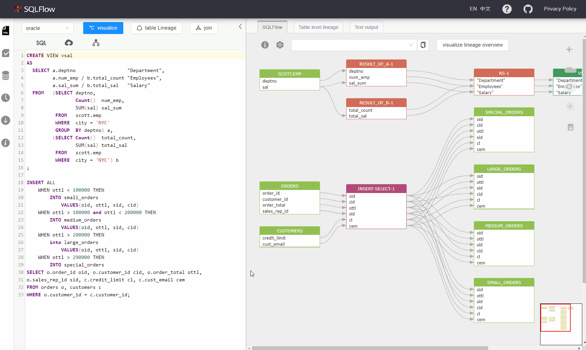
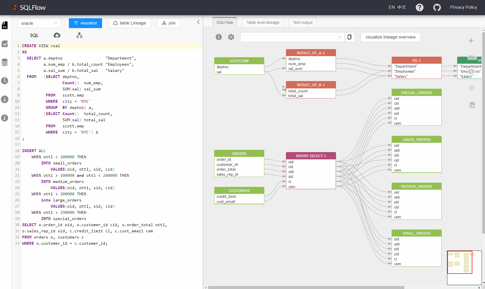

# SQLText Editor

Enter your SQL code in the live editor. You can choose the database under the section of dbvendor. Visualize your data lineage by clicking _`visualize`_ or _`visualize join`_.

<figure><figcaption></figcaption></figure>

When clicking _`visualize`_, we are using the following input paramaters to request the graph API:

| Parameter        | Value                                                              |
| ---------------- | ------------------------------------------------------------------ |
| sqltext          | SQL code in the left live editor, for example `select * from a;`   |
| dbvendor         | database selected under the dbvendor section such as _`dbvoracle`_ |
| showRelationType | fdd                                                                |
| ignoreFunction   | true                                                               |

When clicking _`visualize join`_, we are using the following input paramaters to request the graph API:

| Parameter        | Value                                                              |
| ---------------- | ------------------------------------------------------------------ |
| sqltext          | SQL code in the left live editor, for example `select * from a;`   |
| dbvendor         | database selected under the dbvendor section such as _`dbvoracle`_ |
| showRelationType | join                                                               |
| ignoreFunction   | true                                                               |

### Switch sample SQL

Click the dbvendor menu and select the database. Click sample _`SQL`_ to get the sample sql corresponding to this dbvendor in the live editing box.

<figure><figcaption></figcaption></figure>

### Visualize a column or table by dropdown menu

<figure><figcaption></figcaption></figure>

### Hover sqltext to highlight graph

Hover over sqltext to find the corresponding graph.

<figure><figcaption></figcaption></figure>

### Hover graph to highlight sqltext

Hover over graph to find the corresponding sqltext.

<figure><figcaption></figcaption></figure>

### Resize left panel width

Hover over the edge of the panel. You can drag and change the width when there is a highlight.

<figure><figcaption></figcaption></figure>

### Pin graph, drag graph, and cancel

Click a column in the graph to fix the upstream and downstream relationships. Press and hold down the left mouse button to move the canvas.

<figure><figcaption></figcaption></figure>
